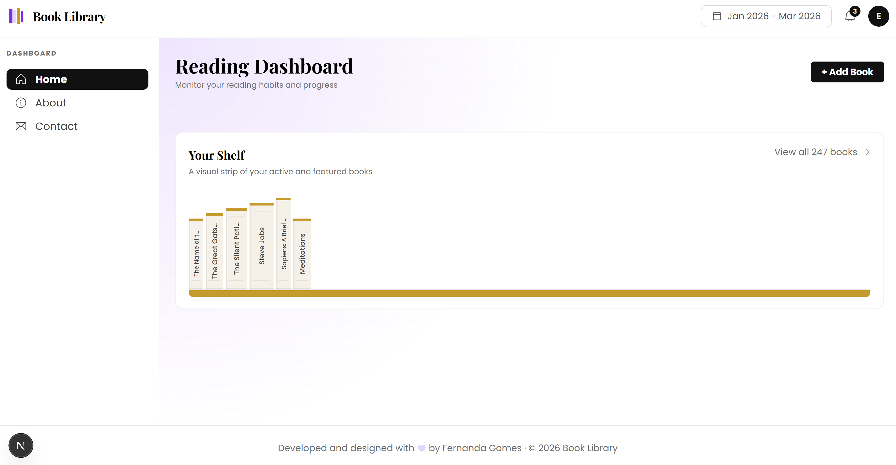

# 📚 Book Library App

A modern, responsive web application built with `Next.js` and `Tailwind CSS` to explore, search, and manage a collection of books. This project focuses on learning and applying core `Next.js` concepts, including routing, layouts, and modern React patterns.

[](https://nextjs.org)
[](https://tailwindcss.com)
[](https://www.typescriptlang.org)

---

## ✨ Overview

Book Library App is a front-end focused project built to practice modern Next.js development. The goal was not only to understand how Next.js structures applications and improves performance, but also to build a clean and intuitive user interface.

The interface emphasizes:

- clarity
- usability
- component reusability
- responsive behavior

---

## ⚡ What I Learned About Next.js

This project was used as a hands-on way to learn key Next.js features:

🧭 App Router (Next.js 13+)

- Used the App Router (/app directory) for page structure
- Implemented file-based routing (app/page.tsx, nested routes)
- Learned how layouts work with layout.tsx

🧱 Layouts & Component Structure

- Created reusable layouts for consistent UI
- Separated concerns between UI components and pages
- Organized scalable folder structure

⚙️ Server vs Client Components

- Understood the difference between:
  - Server Components (default)
  - Client Components ("use client")
- Used client components for interactivity (modals, forms)

🔍 SEO with Metadata API

- Implemented page metadata using Next.js Metadata API
- Improved SEO and social sharing (Open Graph)

⚡ Performance Optimizations

- Leveraged built-in optimizations like:
- Automatic code splitting
  Optimized font loading using `next/font`, integrated with Tailwind CSS for consistent typography across the design system

## 🎨 UI & Design

The UI was created using an `AI-assisted` design workflow, focusing on:

- Defined the initial concept using references or descriptions
- Selected the appropriate tech stack (React, Next.js, Tailwind)
- Established a clear visual direction (clean, modern UI)
- Structured the layout into reusable components
- Implemented a consistent theming system (light mode)
- Refined the interface through incremental improvements

AI tools were used to support design decisions, not replace them.

---

## ⚙️ Tech Stack

- `Next.js` – React framework with App Router and SSR capabilities
- `React` – Component-based UI development
- `Tailwind CSS` – Utility-first CSS framework
- `TypeScript` – Type-safe JavaScript
- `React Icons` – Icon library

---

## 🚀 Features

- - Browse books through a clean and structured interface
- Search and filter by genre
- Add new books via modal form (currently for demonstration purposes only)
- Responsive design (desktop & tablet)
- Light mode support (dark mode was explored during AI-assisted design but is not yet implemented)
- SEO optimized pages using Next.js Metadata API

---

## 🤖 AI Usage

AI tools were used as part of the design and development process to:

- Assist in UI exploration and ideation
- Accelerate layout creation
- Improve visual consistency

All architecture, logic, and implementation decisions were made manually.

---

## 🧪 Getting Started

### 1. Clone the repository

```bash
git clone https://github.com/FP22FD/nextjs-dashboard-example.git
cd nextjs-dashboard-example
```

### 2. Install dependencies

```bash
npm install
```

### 3. Run the development server

```bash
npm run dev
```

Open [http://localhost:3000](http://localhost:3000) in your browser to see the result.

You can start editing the page by modifying `app/page.tsx`. The page auto-updates as you edit the file.

This project uses `next/font` to automatically optimize and load fonts.

---

## 🌐 Deployment

This project can be deployed using platforms such as:

- Vercel (recommended for Next.js)
- Render
- Azure

---

## 📌 Notes

- Built with focus on Next.js architecture and best practices
- Demonstrates App Router, layouts, and component patterns
- Metadata configured with Next.js Metadata API for SEO and Open Graph
- Ready to be extended with backend integration (e.g., .NET API + PostgreSQL)

---

## 🔮 Future Improvements

- Implement backend integration for persistent data (e.g. .NET API + PostgreSQL)
- Add dark mode support with Tailwind and design system tokens
- Improve accessibility (ARIA labels, keyboard navigation)
- Enhance modal functionality with full CRUD support

---

## 📷 Preview


